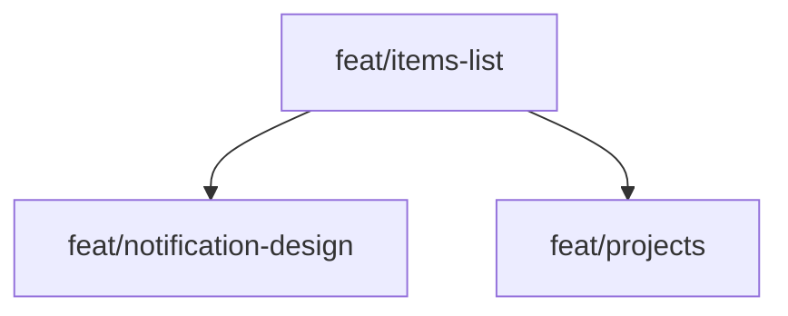

## Roadmap

### Branch prefix (separated by `-`). The letters/absence stand for:
1. `w/t/` `website/tauri/all`
1. `m/d/` `mobile/desktop/all`

### Steps=branches:
- [x] `docs/roadmap` the changes to the current file
- [x] `fix/wm-height` the page shows extra size after hiding and showing back navigation bar (vh -> dvh)
- [x] `feat/items-list` move the items to a variable, so the attributes are easily accessible, and then saved as a **project**
- [ ] `feat/notification-design` the toast container appears under the top bar on mobile, the design should be more compact
- [ ] `fix/items-list-add-order` make tge order in app respect tge order in the attribute
- [ ] `fix/tm-external-links` neither http nor https links are working (open in external app)
- [ ] `feat/projects` add the functionality of other lists of things to copied
- [ ] `feat/nfc-read-card-num` add the functionality of reading card number by touching the card by NFC
- [ ] `feat/ocr-read-card-num` add the functionality of reading card number by using device camera / image

